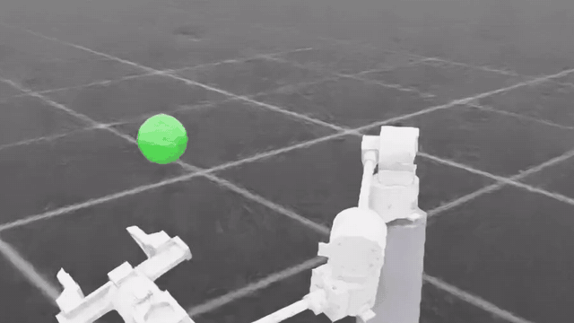
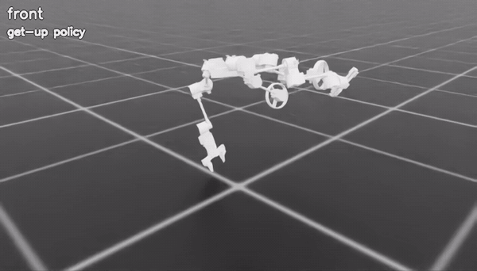
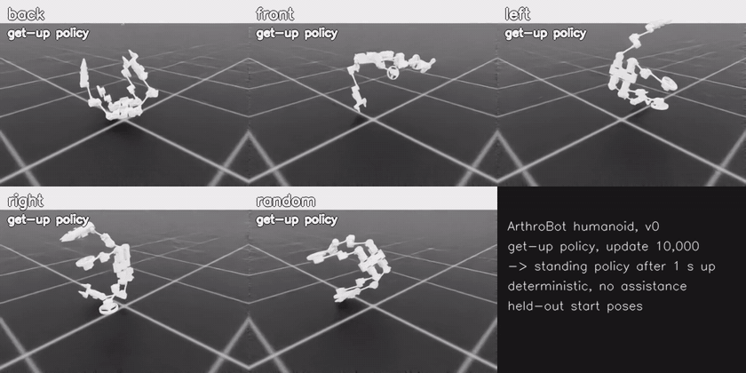

# ArthroBot

ArthroBot is a modular robot system. One motor **module** is the building block.
Six modules make an **arm**, and twenty make a wheel-legged **humanoid**. Each robot
goes from its Onshape CAD export to a physics model and then to trained policies in
NVIDIA Isaac Lab.

ArthroBot grew out of, and remains part of, Chen's modular robot work
([AnotherIsaacSim](https://github.com/Chenaah/AnotherIsaacSim)). This repository holds
only the ArthroBot line and runs on the official Isaac Lab.

## Demos (version 0)

The included policies in simulation. These are current training results, not final
versions.

| Arm: reaching random targets (green sphere) | Humanoid: getting up, then turning to the standing pose |
| --- | --- |
|  |  |
| a new target every 2 s; median error 2.2 mm | gets up from lying face down in about 1.6 s with no assistance; after 1 s of standing the standing policy takes over and balances |



The whole sequence from held-out poses of all five start families: lying on the back,
front, left or right side, or in a random orientation. Each robot gets up with the
get-up policy, and after 1 s of standing the standing policy takes over (its label
turns green). In tests, 99.4% stay up through the hand-over. The arms end down at the
sides, not yet exactly in the standing pose
(see [the hand-over](docs/humanoid.md#hand-over-from-get-up-to-standing)).

| Stage | What exists | Details |
| --- | --- | --- |
| Module | CAD of one joint module; motor and part data shared by all robots | [module](source/arthrobot_assets/module/README.md) |
| Arm | 6 modules + DM4310 rack-and-pinion gripper; validated model; TCP reach policy | [docs/arm.md](docs/arm.md) |
| Humanoid | 20 modules, two arms, two wheel legs; standing, get-up from lying, hand-over | [docs/humanoid.md](docs/humanoid.md) |
| Next | describe new morphologies from a module library; later, an arm that assembles modules into a humanoid for different tasks | — |

## Results (simulation only)

| Policy | Result | Checkpoint |
| --- | --- | --- |
| Arm reach | median TCP error 2.2 mm; 97.7% of targets within 1 cm | `checkpoints/arm_reach/model_550.pt` |
| Humanoid standing | 32/32 deterministic 15 s trials stay upright (largest tilt 1.6°) | `checkpoints/humanoid_standing/model_4999.pt` |
| Humanoid get-up | stands up from 99.4% of held-out lying poses with no assistance, in 1.6 s | `checkpoints/humanoid_getup/model_10000.pt` |
| Hand-over (get-up → standing) | 99.4% stay up after switching to the standing policy | both humanoid checkpoints |

Nothing has been run on the real robots yet.

## Layout

```
source/
  arthrobot/              shared core: URDF and mass tools, motor and gripper specs, USD import, Isaac Sim UI panels
    data/                 motors.json, parts.json (part masses), dm4310_gripper.json
  arthrobot_assets/       robots: read-only CAD exports and the builders that turn them into URDF/USD
    module/               one joint module (reference CAD)
    arm/                  6-DOF arm + gripper  (build.py → build/arm/arm.urdf, usd.py → arm.usd)
    humanoid/             wheel-legged humanoid (build.py, training_model.py, nominal_pose.py, usd.py)
  arthrobot_tasks/        Isaac Lab tasks
    arm_reach/            manager-based reach task, registered as ArthroBot-Arm-Reach-v0
    humanoid/standing/    hybrid standing (rsl_rl PPO)
    humanoid/getup/       get-up from lying (multi-critic PPO), hand-over, pose banks, joint limits
scripts/                  entry points: arm/, humanoid/, rsl_rl/ (official Isaac Lab train.py / play.py)
checkpoints/              the three trained policies above
tests/                    model and policy-logic tests (no simulator needed)
docs/                     arm.md, humanoid.md, history/ (earlier experiments)
build/, logs/             generated models and training runs (git-ignored)
```

Generated files (URDF, USD, collision hulls, reports) are rebuilt automatically when
their inputs change, so the repository stores only CAD exports, data and code.

## Install

Requirements: Linux and an NVIDIA GPU, with:

- Isaac Sim 5.1;
- Isaac Lab, tested at commit [`6f59b88f`](https://github.com/isaac-sim/IsaacLab/commit/6f59b88ff6f3b15b63d534cc2165190b213b691f) (`isaaclab` 0.47.4);
- `rsl-rl-lib` 3.0.1;
- Python 3.11 and PyTorch 2.7.

1. Install Isaac Sim and Isaac Lab by following the
   [Isaac Lab installation guide](https://isaac-sim.github.io/IsaacLab/main/source/setup/installation/index.html).
   Install `rsl-rl-lib==3.0.1` as well.
2. In the same Python environment:

   ```bash
   git clone git@github.com:xhy5588/ArthroBot.git && cd ArthroBot
   pip install -e ".[video,test]"
   python -m pytest tests          # about 20 s; builds both robot models
   ```

**Rendering on NVIDIA 595.x drivers.** The GUI, cameras and videos need a Vulkan
workaround for Isaac Sim 5.1
([isaac-sim/IsaacSim#568](https://github.com/isaac-sim/IsaacSim/issues/568)). Build it
once with `bash scripts/setup_rtx_compat.sh`. The ArthroBot scripts then load it
automatically, for their own process only. Wrap the official Isaac Lab scripts
instead: `python -m arthrobot.sim.rtx_compat python scripts/rsl_rl/play.py ...`. Set
`ARTHROBOT_VULKAN_PROFILES` if the layer is somewhere other than
`~/.cache/arthrobot-vulkan-profiles`. Headless training does not need it.

## Quick start

Run everything from the repository root. Add `--headless` to skip the GUI.

```bash
# Arm
python scripts/arm/view.py --gripper-demo                                # arm and gripper with control panels
python scripts/rsl_rl/train.py --task ArthroBot-Arm-Reach-v0 --headless --num_envs 1024
python scripts/rsl_rl/play.py --task ArthroBot-Arm-Reach-Play-v0 --checkpoint checkpoints/arm_reach/model_550.pt
python scripts/arm/evaluate.py                                           # reach accuracy of a checkpoint

# Humanoid
python scripts/humanoid/view.py                                          # suspended motor test rig
python scripts/humanoid/train_standing.py --mode preview                 # watch the standing policy
python scripts/humanoid/train_standing.py --mode train --headless --iterations 5000
python scripts/humanoid/train_getup.py --num-envs 4096                   # get-up training (headless)
python scripts/humanoid/evaluate_getup.py                                # held-out get-up evaluation
python scripts/humanoid/handoff.py                                       # get up, then hand over to standing
python scripts/humanoid/record_getup.py                                  # MP4 of five get-up starts
```

Scripts explain their options with `--help`. Training runs are written to `logs/`
and reports to `build/`.

**Changing a robot.** The CAD exports are inputs and are never edited. To change
masses, motors or the gripper, edit the JSON files in `source/arthrobot/data/` or
`humanoid/hardware.json`; the models and USD files rebuild on the next run. The
builders check a hash of their CAD export. A new export therefore stops with a
message, because the part grouping must be reviewed in `build.py` first.

## Credits

- Chen's modular robot and the [AnotherIsaacSim](https://github.com/Chenaah/AnotherIsaacSim) workspace, where this work started.
- [Isaac Lab](https://github.com/isaac-sim/IsaacLab) (BSD-3-Clause). `scripts/rsl_rl/`
  contains its `train.py`, `play.py` and `cli_args.py`; the only change is one import
  that registers the ArthroBot tasks. Its license is in `scripts/rsl_rl/LICENSE`.
- [RSL-RL](https://github.com/leggedrobotics/rsl_rl) for PPO.
- [HoST](https://arxiv.org/abs/2502.08378) (Huang et al., 2025), which the get-up task is adapted from.
- Seeed Studio [reBot-DevArm](https://github.com/Seeed-Projects/reBot-DevArm), the
  reference for the DM4310 gripper transmission.

## License

There is no license yet. Until one is added, all rights are reserved.
