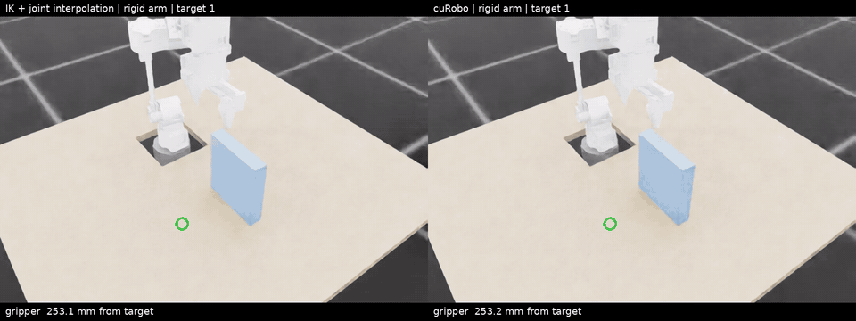
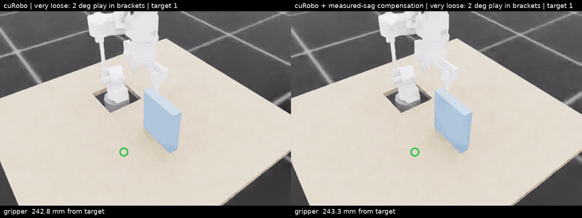

# Arm motion: IK, collision-free planning and a loose printed arm

The reach policy (see [arm.md](arm.md)) moves the gripper to a point, but it knows
nothing about obstacles or gripper orientation. This page covers the parts that do:
- **IK for the gripper's full pose:** position and orientation.
- **Collision-free planning** with NVIDIA [cuRobo](https://github.com/NVlabs/curobo).
- **A test model of a loose 3D-printed arm**, and what it takes to keep the
  planned paths collision-free on it.

All of it runs in simulation only. Code: `source/arthrobot_tasks/arm_planning/` and
`scripts/arm/`.

| Old planner vs cuRobo, table and wall | Very loose printed arm: plan only vs measured-sag compensation |
| --- | --- |
|  |  |

## Kinematics and IK

`kinematics.ArmModel` is the arm's rigid model, built from `build/arm/arm.urdf`
and written in torch. It provides:
- forward kinematics;
- TCP and gripper-rotation Jacobians;
- gravity torques, which match the simulator: 7.73 and 2.97 N m on joints 2 and
  3 at the zero pose;
- IK.

Everything is in the reach task's mount frame (x forward, z up, origin at the
bottom of the base).

**Gripper frame** (at the TCP):
- z = approach, the direction the gripper points;
- y = the jaw closing axis;
- x = y × z.

The jaws are symmetric, so a grasp is the same with the gripper turned 180° about z.

**The joints are not a textbook arm:**
- J1 turns the base;
- J2 is the shoulder pitch;
- J3 rolls the upper arm about its length;
- J4 and J5 are parallel (elbow and wrist bend in one plane);
- J6 rolls the gripper.

There is no closed-form IK, so `ik_pose` runs damped least squares from the
current joint angles and from six fixed start poses. It tries both versions of
the grasp (turned or not), and keeps the solution that:
1. reaches the pose within 0.5 mm and 0.5°;
2. has joint 5 within ±60°;
3. needs the least joint travel within the ±180° joint limits.

**Two rules came from collisions in simulation:**
- Joint 5 beyond about 60° (with joint 4 bent) folds the gripper into the forearm.
- Grasp targets closer than 15 cm to the base let the jaws hit the base or shoulder.

**Reachable grasps** (rigid model):
- **Pointing straight down:** 98% of positions 5–25 cm in front of the base, up
  to 15 cm high; 22–30% at 35–45 cm.
- **Tilted 45°:** 75–100% at 35–45 cm.

`controllers.IKController` turns IK into motion:
- all joints move along one minimum-jerk path to the solution;
- each servo target is offset by gravity torque / 80 N m/rad, to cancel the servo sag;
- optional corrections from a camera or from the 14-bit output encoders.

It does not avoid obstacles.

## Collision-free planning with cuRobo

**Install.** cuRobo v2 compiles its GPU code at run time, so no CUDA toolkit is
needed. In the Isaac Lab environment:

```bash
git clone https://github.com/NVlabs/curobo.git ~/curobo
pip install viser yourdfpy numpy-quaternion setuptools_scm "cuda-core[cu12]>=0.7"   # its dependencies
pip install --no-deps --no-build-isolation -e ~/curobo
```

Use `--no-deps` and add the missing dependencies by hand, so pip leaves Isaac
Sim's pinned packages alone. This was tested with cuRobo 0.8.0 at commit 78fd485.

```bash
python scripts/arm/build_curobo_robot.py      # planning URDF + collision spheres (~4 min) -> build/arm_planning/
python scripts/arm/check_curobo_model.py      # FK, jaw tips and self-collision against the simulator
python scripts/arm/plan_trajectories.py       # plan a pick sequence two ways -> logs/arm_planning/plans.npz
python scripts/arm/run_plans.py               # replay both in physics with a real table and wall
```

**The arm's collision model** (`curobo_robot.py`): cuRobo fits 97 spheres to the
535 CAD meshes, covering 82–98% of each link. Three fixes were needed:
- **The base:** the fitter keeps spheres 2 cm above a clip plane, and the base is
  only 5 cm tall. Clipping at its bottom face left 4 spheres covering 7% of it,
  so the plane sits 2 cm lower.
- **The jaw tips:** the jaws reach 46.9 mm past the TCP, but the fitted spheres
  stopped 6 mm short. In simulation the tips then touched the table at grasps the
  planner thought were clear. Three extra spheres now enclose each jaw's last 8 mm.
- **A 5 mm margin** on every sphere, for obstacle and self-collision checks.
  - At one pose the simulator saw the forearm touch the gripper (true gap about
    1.7 mm), and the bare spheres missed it.
  - cuRobo's `self_collision_buffer` adds to this margin, so it is zero; with
    both set, every sphere was 10 mm bigger for self-collision checks.

**Checks** (`check_curobo_model.py`):
- cuRobo's TCP pose matches `ArmModel` within 0.0001 mm.
- The spheres reach 54 mm past the TCP, beyond the 46.9 mm jaw tips.
- All 4 arm poses where the simulated arm touched itself are flagged.
- None of the 384 grasp poses the simulator ran without contact are flagged.

**Comparison** (`plan_trajectories.py`, `run_plans.py`):
- **Scene:** a table at the base's height (with a hole around the base) and a
  16 cm wall in front of the arm.
- **Targets:** straight-down grasps that alternate left and right of the wall,
  8 sequences × 6 targets.
- **Planners:** the IK controller vs cuRobo's `MotionPlanner.plan_pose`.
- **Replay:** in physics, with contact sensors on the arms.

| | IK + joint interpolation | cuRobo |
| --- | ---: | ---: |
| Targets planned | all 48 attempted | 44 of 48 (the other 4 are impossible) |
| Planning time | – | median 0.10 s, max 1.3 s |
| Moves with contact (physics) | **86%** | **0%** |
| Final error on the feasible targets (median) | **169 mm**, stuck on the wall or table | **0.02 mm** |

The targets cuRobo refuses sit right next to the wall. For each, about 130 IK
solutions reach the pose, and all of them put the jaws into the wall.

**What the planner knows:** only what it is given. The table and the wall are
boxes in `obstacles.py`, and the grasp targets are given too. A real setup needs
the fixed obstacles measured, and a depth camera for anything else; cuRobo can
build obstacles from depth images. Each plan is made once and executed blind.

## A loose printed arm

The arm will be 3D printed (PLA brackets on carbon rods), so its joints will not
be as tight as the rigid simulation model.

**The test model** (`loose.py`): each joint of the arm becomes
**servo → gearbox backlash → bracket flex → bracket play**:
- The servo's angle is what the 18-bit motor encoder reads.
- The MG5010's 14-bit output encoder sees the gearbox backlash, but not the
  bracket flex or play.
- PhysX needs extra inertia on the flex and gearbox joints (an armature of 10%
  of the inertia outboard of each) and 16 solver iterations. With that, the
  static bending matches torque / stiffness within 1%
  (`scripts/arm/check_loose_arm.py`).
- The looseness levels are guesses until the real arm is measured: play per
  joint and bracket stiffness of 0.5° and 1000 N m/rad (typical), 1° and 500
  (loose), 2° and 250 (very loose).

**cuRobo's plans replayed on the loose arm**, with the play in the brackets where
no encoder sees it:

```bash
python scripts/arm/run_plans.py --arms rigid:curobo,loose:curobo:none,loose:curobo:camera,loose:curobo:track,loose:curobo:model \
    --levels typical_bracket,loose_bracket,very_loose_bracket --hold 2 --name loose_corrections
```

Each cell is moves with contact / final error (median):

| | Typical | Loose | Very loose |
| --- | --- | --- | --- |
| Rigid arm (reference) | 0% / 0.01 mm | | |
| Plan only | 4.5% / 5.6 mm | 9.1% / 10.9 mm | 68% / 20.4 mm |
| + camera correction at the target | 4.5% / 0.9 mm | 11% / 2.2 mm | 82% / 4.6 mm |
| + camera tracking during the move | **0%** / 1.6 mm | **0%** / 3.0 mm | **0%** / 6.9 mm |
| + measured-sag compensation | **0%** / 1.2 mm | **0%** / 2.3 mm | 4.5% / 4.3 mm |

**What this shows:**
- **The sag eats the planner's margin.** The plans assume a rigid arm, so the
  jaws brush the table or wall on the way down to targets whose jaw tips end
  13 mm above the table.
- **A bigger planning margin does not fix it.** Planning with every obstacle
  grown by another 10 mm (`plan_trajectories.py --obstacle-margin 0.01`):
  - cuRobo plans 40 of 48 targets instead of 44;
  - moves with contact go 4.5 → 5% (typical), 9 → 7.5% (loose), 68 → 60% (very loose).

  The arm still has to come down to the target.
- **Correcting only at the target** fixes the final accuracy but not the
  contacts on the way.
- **What works is correcting the sag during the move.** Either way, no contacts
  up to the "loose" level and 1–3 mm at the target:
  - **camera tracking:** the camera's gripper pose minus the pose the motor
    encoders imply is the deflection no encoder sees; it is filtered and added
    through the Jacobian;
  - **measured-sag compensation:** no sensor. Each gravity-loaded joint is
    pre-compensated for its bracket bending (gravity torque / stiffness) and
    for its play (half the gap, toward gravity).
- **Both are best cases.** The camera has no delay or noise, and the
  compensation uses the exact play and stiffness. Measuring the real arm's
  play and stiffness is what makes the second one usable.

## Limits and next steps

- **Simulation only.** No driver yet for the MG5010 arm motors, and nothing
  streams plans to a motor board.
- **No sensing:** no obstacle perception, and no grasp-target detection.
- **No pick sequence yet.** cuRobo's `plan_grasp` (approach → grasp → lift)
  isn't used, and a held object isn't part of the collision model.
- **Model assumptions:**
  - joint limits are ±180° placeholders;
  - speed, acceleration and jerk limits are simulation choices;
  - motor torque limits aren't checked;
  - the self-collision pairs cuRobo skips were chosen by random sampling.
