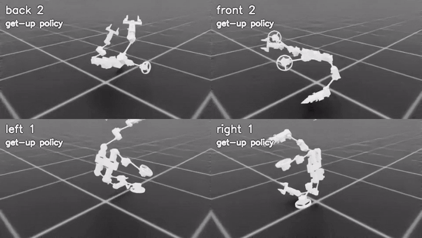

# Humanoid

A wheel-legged humanoid built from 20 MG5010 motor modules: two six-joint arms
with DM4310 grippers, and two legs with two hip joints, a knee and a driven wheel.
Code: `source/arthrobot_assets/humanoid/` (model), `source/arthrobot_tasks/humanoid/`
(tasks) and `scripts/humanoid/`.

| Task | Status (simulation only) | Included policy |
| --- | --- | --- |
| [Standing](#standing) | all 32 deterministic 15 s trials pass | `checkpoints/humanoid_standing/model_4999.pt` |
| [Get-up from lying](#get-up-from-lying) | stands up from 99.7% of held-out lying poses with no assistance | `checkpoints/humanoid_getup/model_25500.pt` |
| [Hand-over](#hand-over-from-get-up-to-standing) | only 45–58% stay up after switching to the standing policy | both of the above |

Nothing has been tried on the real robot yet.

## Model

The Onshape export (`cad/modular_humanoid_bipad/`) is used read-only. It has 178
links and 2,419 meshes; 2,252 meshes hang directly off the root, so its links are
not the robot's bodies. `arthrobot_assets.humanoid.build` regroups them:

- **27 rigid bodies and 26 joints:** 20 motor joints, plus the jaws and pinion of
  each gripper (each gripper is still one motor).
- **Motor ownership:** each motor's housing moves with its input-side body and its
  output carrier with its output-side body. The axis of all 20 motors is checked
  against the motor housing.
- **Excluded:** 669 meshes of disconnected spares (a third torso module with six
  unjointed motors, two loose wheels, two old gripper motors). The 1,750 kept
  meshes keep their exact CAD positions.
- **Collisions:** 150 collision meshes, made of 40 motor exterior hulls and 110
  detailed bracket and gripper meshes.
- **Mass:** 13.27 kg. The torso/battery modules and wheels have not been weighed
  and use solid-PLA density estimates; enter measured values in
  `source/arthrobot_assets/humanoid/hardware.json`.

| Branch | Joints (in order) |
| --- | --- |
| Left / right arm | `<side>_arm_1` … `<side>_arm_6` |
| Left / right leg | `<side>_hip_1`, `<side>_hip_2`, `<side>_knee`, `<side>_wheel` |

Every policy uses the motor order in `MOTOR_JOINTS`: 12 arm joints, 6 leg joints,
2 wheels.

`training_model.py` makes the 21-body training variant. It parks the grippers open
and merges them into the tool bodies, and it turns the torso frame to x forward,
y left, z up. `nominal_pose.py` solves the upright standing pose. The legs are set so
that the center of mass is above the wheel axle with both wheels level, and the
shoulders are raised so the grippers clear the legs. The torso starts at 0.516 m;
the largest static joint torque in this pose is 6.4 N m.

```bash
python -m arthrobot_assets.humanoid.build             # build/humanoid/humanoid.urdf
python -m arthrobot_assets.humanoid.training_model    # build/humanoid_training/robot.urdf
python scripts/humanoid/view.py                       # suspended motor test rig with a control panel
python scripts/humanoid/view.py --validate --headless
```

`view.py --validate` drives every motor both ways, spins each wheel more than one
turn in both directions, cycles both grippers, and then holds a pose under gravity.
Results:

- largest motor target error: 0.016°;
- largest body position error against forward kinematics: 0.0003 mm;
- largest gripper coupling error: 0.002 mm;
- both grippers stop at 48.9 mm per jaw on contact;
- gravity-hold sag: up to 3.8° (PD deflection).

## Standing

Hybrid control. All 20 motors are learned, the torso is free, and there is no
balance controller.

| | |
| --- | --- |
| Actions 0–17 | joint targets = standing pose + 0.25 rad × action, tracked by PD 80 N m/rad, 4 N m s/rad at 240 Hz (angle errors wrap) |
| Actions 18–19 | wheel torque = 13 N m × action |
| Limits | every motor clipped at 13 N m and 74 rpm; implicit PhysX drives off |
| Observation (96) | body velocities, gravity direction, sin/cos of joint angles, joint speeds, last actions, wheel contacts, torso height, COM offset, heading |
| Reward | upright, survival, height, still COM, small drift and heading change, both wheels down, arm clearance from the floor, soft posture, torque, action-change and body-rotation costs |
| PPO | rsl_rl, [256, 256, 128], 48 steps per robot, γ 0.995, entropy 0.002, initial std 0.25, no observation normalization |
| Physics | full asset (convex decomposition), PGS 32/8 at 240 Hz, 60 Hz policy |

**Result** (`model_4999.pt`, 5,000 updates with 12 robots). The evaluation runs
32 deterministic 15 s trials, and **all 32 qualify**. To qualify, a trial must keep
tilt below 20°, the torso above 0.46 m and both wheels down at least 80% of the
time, with a mean speed under 0.15 m/s and drift under 25 cm. The largest tilt was 1.6° and the largest drift 1 cm.

```bash
python scripts/humanoid/train_standing.py --mode check --num-envs 16           # physics and control checks
python scripts/humanoid/train_standing.py --mode train --headless --iterations 5000 --eval-interval 250
python scripts/humanoid/train_standing.py --mode evaluate --headless --num-envs 16 --seconds 30
python scripts/humanoid/train_standing.py --mode preview                       # watch it in the GUI
```

## Get-up from lying

Adapted from [HoST](https://arxiv.org/abs/2502.08378) (Huang et al., 2025) to a robot
with wheels instead of feet. The code is in `source/arthrobot_tasks/humanoid/getup/`.

**Fast physics.** The asset is a light override layer of the training USD: one
convex hull per collision mesh, the joint limits below, and no visual meshes.
Physics is TGS 8/1 at 240 Hz. `benchmark_physics.py` measures the speed-up, with
random PD motion from random orientations:

| Setup | Robots | Transitions/s |
| --- | ---: | ---: |
| full asset, PGS 32/8 | 64 | 229 |
| get-up asset, PGS 32/8 | 64 | 517 |
| get-up asset, TGS 8/1 | 64 | 2,420 |
| get-up asset, TGS 8/1 | 1,024 | 27,603 |

The standing policy still balances in this setup (`validate_standing_physics.py`):
32/32 trials for 30 s, with a largest tilt of 1.3° and a largest drift of 1.2 cm.

**Joint limits from self-collision.** Each limb joint is swept alone from the
standing pose until its convex hulls come within 3 mm of an unjointed body. The
limit is that angle minus 5° (`getup/data/joint_limits.json`). These are geometric
limits only, not the real cable or bracket limits, so combined poses still rely on
simulated self-collision.

**Task:**

- **Starts:** pose banks (`getup/data/pose_banks/`) with the robot lying on its back,
  front, left or right side (±25° jitter, random yaw), or in a random orientation.
  Arms are the standing pose ± 0.6 rad and legs ± 0.4 rad, clipped to the limits.
  The bank holds 2,000 training poses and 160 held-out poses. Self-colliding poses
  are rejected.
- **Episode:** 10 s. The first 0.6 s is passive, so the robot settles first.
- **Actions:** limb target = current angle + bound × action, clipped to the limits.
  The bound decays from 1.0 to 0.25 rad over 3,000 updates. The wheel actions are
  torques.
- **Observations:** the actor sees 6 frames of angular velocity, gravity direction,
  joint angles and speeds, and previous actions. The critic also sees torso height,
  linear velocity, the contact state of all 21 bodies and the curriculum state.
- **Reward groups**, each with its own critic and advantage weight:

  | Group | Weight | Terms |
  | --- | ---: | --- |
  | task | 2.5 | torso height, uprightness, standing |
  | regularization | 0.1 | joint acceleration, action rate and smoothness, torque, power, soft joint and speed limits |
  | style | 1 | hip abduction, shanks pointing down, wheel track, low tilt rate, no body–floor contact near standing |
  | target | 1 | near standing: stillness, standing posture, level torso, height, both wheels down |
  | safety | 1.5 (final stage) | new self-contact, contact left from settling, limb speed above 50%, torque above 9 N m, torso rotation rate |

- **Curricula:**
  - an upward pull on the torso starts at 65 N (about half the body weight) and
    drops by 13 N after each held-out evaluation with at least 15% success;
  - the action bound shrinks as above.
- **Randomization:**
  - at startup: friction, restitution, link masses ±10%, torso payload −0.3 to
    +0.8 kg, torso COM ±2 cm;
  - at each reset: PD gains ±15%, motor strength 90–110% (85–100% in the final
    stage), joint offsets ±0.03 rad, action delay 0–25 ms;
  - observation noise.
- **PPO:** multi-critic PPO (`getup/ppo.py`; rsl_rl has no multi-critic version).
  Advantages are computed and normalized per group. The actor is [512, 256, 128] and
  the critic [512, 256] with one head per group. It adds L2C2-style smoothness and
  bootstraps timeouts from the true final state.

**Success** means standing (torso above 0.46 m, tilt below 15°, both wheels down) for
2 s in a row. Evaluations are deterministic, with no pull force and no observation
noise.

**Result** (`model_25500.pt`, 4,096 robots cycling the 160 held-out poses):

| Measure | Value |
| --- | ---: |
| stood up and held 2 s | 99.7% |
| time to stand (after the motors switch on) | 2.06 s |
| stood up without creating self-contact | 58.5% |
| peak limb joint speed | 5.5 rad/s (motor max 7.75) |
| ready pose: every limb within ±0.25 rad of the standing pose for 1 s | 0% |

On a fresh bank that was never used in training (`fresh_seed2042_32.json`), the
update-21,500 checkpoint scored the same as on the held-out bank (99.75% vs 99.62%).

**How it was trained.** Each stage resumed from a checkpoint of the previous one:

| Updates | Change | Outcome |
| --- | --- | --- |
| 0–10,000 | 1,024 robots; pull force gated on training success | pull force stuck at 65 N; 32% success |
| 9,500–15,500 | 4,096 robots; pull force gated on held-out evaluation | pull force 65 → 0 N; 99.5% success with no assistance |
| 13,250–16,250 | self-contact penalty | clean success 48% → 57% |
| 16,250–21,500 | safety group, ready-pose and posture terms, entropy 0.01, std floor 0.2 | ready pose still 0% |
| 21,500–25,500 | 3 s stand-up schedule, γ 0.997, 25% upright starts | time to stand 1.4 → 2.1 s; hand-over 26% → 57.5% |

The defaults of `train_getup.py` are the first stage. Its docstring gives the
final-stage command; every setting is also recorded in
`checkpoints/humanoid_getup/settings.json`.

```bash
python scripts/humanoid/train_getup.py --num-envs 4096                    # train (headless); logs/humanoid_getup/
python scripts/humanoid/evaluate_getup.py                                 # held-out evaluation + self-contact by body
python scripts/humanoid/record_getup.py                                   # MP4 of the five start families
python scripts/humanoid/watch_getup_run.py --run-dir logs/humanoid_getup/<run> --every 250 --handover
                                                                          # video + hand-over test per new checkpoint
python scripts/humanoid/validate_standing_physics.py                      # standing policy in the get-up physics
python scripts/humanoid/benchmark_physics.py --num-envs 1024              # physics throughput
python scripts/humanoid/make_pose_banks.py lying --seed 42 --per-family 400
python scripts/humanoid/sweep_joint_limits.py
```

`evaluate_getup.py` (320 robots, seed 7) reproduces the original code exactly: 100%
stood, 2.06 s to stand. Stop training with SIGTERM: the trainer finishes the current
update, saves and exits.

**Demo clips** (`docs/media/humanoid_*.gif`). They need the RTX workaround (see the
README) and are written to `build/humanoid_training/getup_videos/`. Each rendered robot
needs about 1.5 GB of host memory, so record one family per run:

```bash
V=build/humanoid_training/getup_videos
python scripts/humanoid/record_getup.py --plain                                  # get-up, all five start families, 10 s
python scripts/make_gif.py $V/update_025500_plain.mp4 docs/media/humanoid_getup_starts.gif --width 840 --fps 10 --colors 64

# Get-up, then hand-over to the standing policy: 4 starts of one family, 14 s
python scripts/humanoid/record_getup.py --plain --handover --families front --poses-per-family 4 --seconds 14 \
    --tile-width 800 --tile-height 450
python scripts/make_gif.py $V/update_025500_front_x4_handover_plain.mp4 docs/media/humanoid_getup_to_standing.gif \
    --crop 800:450:800:0 --width 600 --fps 10 --duration 10 --colors 64   # robot "front 2"
```

`humanoid_handover_successes.gif` combines four such runs (480×270 tiles): robot 2 of
`back` and `front`, and robot 1 of `left` and `right`.

**Joint-limit provenance.** The committed `joint_limits.json` was swept from an
earlier standing pose, which differs from the current one by up to 2.6° (left hip).
The included policy was trained with these limits, so they stay unchanged.
`sweep_joint_limits.py` sweeps from the current standing pose. Re-sweep, re-make the
pose banks and retrain together.

## Hand-over from get-up to standing

`handoff.py` runs the get-up policy. Once a robot has stood for 1 s, even-numbered
robots switch to the standing policy and odd-numbered robots keep the get-up policy.
The standing policy's heading and COM inputs are measured from the moment it takes
over.

| 640 robots, 30 s, seed 7 | Stayed standing |
| --- | ---: |
| switched to the standing policy (318 robots) | 45.3% |
| kept the get-up policy (320 robots) | 100% |

(An earlier 20 s test with 320 robots gave 57.5%.)

When it works, the standing policy swings the arms down to the standing pose within
about a second and then balances. `record_getup.py --handover` records it. A run with
4 held-out starts per family, without randomization, gave these results:

- **11 of 20 robots** ended in the standing pose and stayed upright;
- by family: left 4/4, right 3/4, back 2/4, front 2/4, random orientation 0/4.

One success from each of the first four families:



**Main open problem.** The get-up policy never brings its arms back to the standing
pose. At hand-over every robot has an arm outside the ±0.25 rad range the standing
policy uses: on average the left shoulder is 2.87 rad from it and the right shoulder
1.15 rad. In 59% of robots one gripper is in front and one behind. Posture rewards of
up to 1.0 per radian did not change this, although the straight path back to the
standing pose is free of collisions.

Next steps, not yet tried:

1. A scripted arm return before the hand-over: blend the arm targets to the standing
   pose over about 1 s. This can be tested in `handoff.py` without training.
2. Make the standing policy tolerant of any arm pose by fine-tuning it from upright
   starts with random arms (`standing_seed7_800.json`).
3. Halve the get-up entropy bonus (0.01 → 0.005). Action noise ended at 0.75, and with
   noise on the robots almost never stand calmly during training, so the policy
   rarely sees the ready pose.

The tilt-recovery experiments that came before the get-up task are summarized in
[history/](history/README.md).
